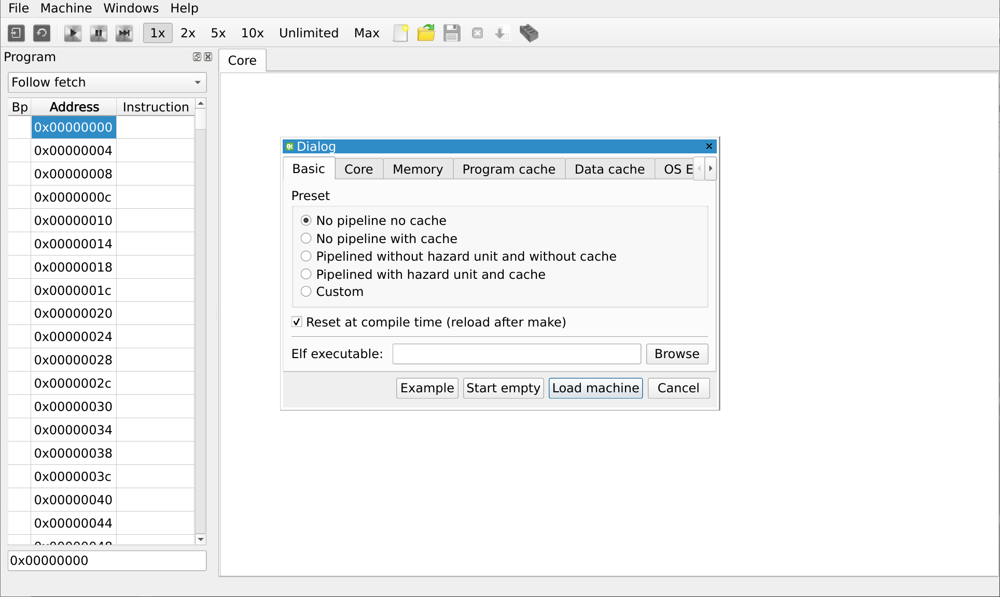
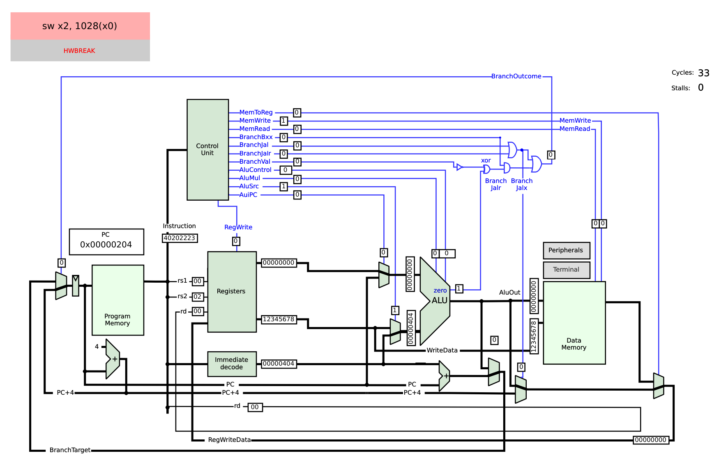
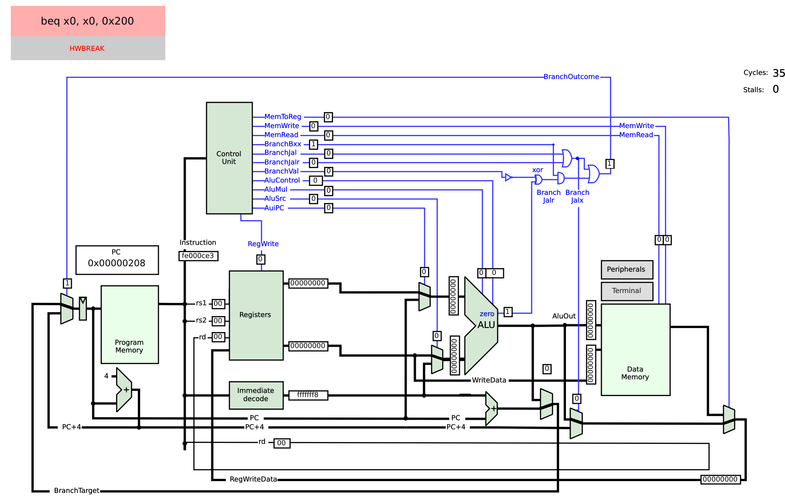
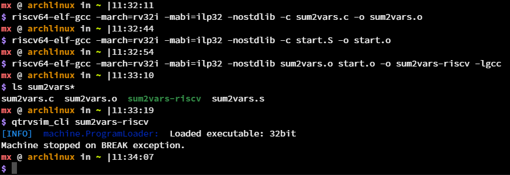

# QtRvSim - 教学用 RISC-V CPU 模拟器

## 介绍

[QtRvSim](https://github.com/cvut/qtrvsim) 是一个图形化 RISC-V CPU 模拟器，其提供了基于 WebAssembly 的（实验性）版本，在现代浏览器中无须安装即可运行。

除此之外，也提供基于 Qt 的版本，[GitHub release](https://github.com/cvut/qtrvsim/releases) 中包含了 macOS、Windows (mingw32)、AppImage 等多种构建。软件已在 Ubuntu [PPA](https://launchpad.net/~qtrvsimteam/+archive/ubuntu/ppa)、Arch Linux [AUR](https://aur.archlinux.org/pkgbase/qtrvsim) 和 [nixpkgs](https://github.com/NixOS/nixpkgs/blob/release-23.05/pkgs/applications/science/computer-architecture/qtrvsim/default.nix) 等上架。

也可以从 [openSUSE Build Service](https://software.opensuse.org/download.html?project=home%3Ajdupak&package=qtrvsim) 获取各个发行版可用的软件包。

## 安装

### Ubuntu

```bash
sudo add-apt-repository ppa:qtrvsimteam/ppa
sudo apt update
sudo apt install -y qtrvsim
```

### Debian Unstable / 11

前往 [OBS](https://software.opensuse.org/download.html?project=home%3Ajdupak&package=qtrvsim) 获取软件包。

请注意下方的链接未必是最新。

#### Debian Unstable

```bash
echo 'deb http://download.opensuse.org/repositories/home:/jdupak/Debian_Unstable/ /' | sudo tee /etc/apt/sources.list.d/home:jdupak.list
curl -fsSL https://download.opensuse.org/repositories/home:jdupak/Debian_Unstable/Release.key | gpg --dearmor | sudo tee /etc/apt/trusted.gpg.d/home_jdupak.gpg > /dev/null
sudo apt update
sudo apt install qtrvsim
```

#### Debian 11

```bash
echo 'deb http://download.opensuse.org/repositories/home:/jdupak/Debian_11/ /' | sudo tee /etc/apt/sources.list.d/home:jdupak.list
curl -fsSL https://download.opensuse.org/repositories/home:jdupak/Debian_11/Release.key | gpg --dearmor | sudo tee /etc/apt/trusted.gpg.d/home_jdupak.gpg > /dev/null
sudo apt update
sudo apt install qtrvsim
```

### Arch Linux

从 [AUR](https://aur.archlinux.org/pkgbase/qtrvsim) 获取，可使用任意 AUR Helper。

```bash
yay -S qtrvsim
# paru -S qtrvsim
```

或者添加 OBS 软件源（以 root 用户执行）：

```bash
cat << "EOF" >> /etc/pacman.conf
[home_jdupak_Arch]
Server = https://download.opensuse.org/repositories/home:/jdupak/Arch/$arch
EOF
key=$(curl -fsSL https://download.opensuse.org/repositories/home:jdupak/Arch/$(uname -m)/home_jdupak_Arch.key)
fingerprint=$(gpg --quiet --with-colons --import-options show-only --import --fingerprint <<< "${key}" | awk -F: '$1 == "fpr" { print $10 }')
pacman-key --init
pacman-key --add - <<< "${key}"
pacman-key --lsign-key "${fingerprint}"
pacman -Sy home_jdupak_Arch/qtrvsim
```

### Fedora

```bash
dnf config-manager --add-repo https://download.opensuse.org/repositories/home:jdupak/Fedora_37/home:jdupak.repo
dnf install qtrvsim
```

### Windows

从 [GitHub Release](https://github.com/cvut/qtrvsim/releases) 获取最新二进制 `qtrvsim-mingw32`，下载并解压。

## GUI 使用

QtRvSim 既可以在 GUI 使用，也可以在 CLI 使用。GUI 可以选择在线版：
[QtRVSim online](https://comparch.edu.cvut.cz/qtrvsim/app)

也可以下载 GitHub release 中提供的版本，或者也可自行编译。构建时依赖 Qt5 和 elfutils，需要提前安装。以下以网页在线版演示。

打开 [QtRVSim online](https://comparch.edu.cvut.cz/qtrvsim/app)，选择（默认的） `No pipeline no cache`，点击 `Start Empty`。



我们使用程序自带的模板进行演示。点击 `File > Examples > simple-lw-sw-ia.S`


可以看到，模板程序是一个简单的存取操作

```asm
//  Template file with simple memory example
//  QtRVSim simulator https://github.com/cvut/qtrvsim/
//
//  template-os.S       - example file
//
//  (C) 2021 by Pavel Pisa
//      e-mail:   pisa@cmp.felk.cvut.cz
//      homepage: http://cmp.felk.cvut.cz/~pisa
//      work:     http://www.pikron.com/
//      license:  public domain

// Directives to make interesting windows visible
#pragma qtrvsim show registers
#pragma qtrvsim show memory

.globl _start
.option norelax

.text

_start:
loop:
	// load the word from absolute address
	lw     x2, 0x400(x0)
	// store the word to absolute address
	sw     x2, 0x404(x0)

	// stop execution wait for debugger/user
	// break
	// ensure that continuation does not
	// interpret random data
	beq    x0, x0, loop
	nop
	nop
	ebreak

.data
.org 0x400

src_val:
	.word  0x12345678
dst_val:
	.word  0

// Specify location to show in memory window
#pragma qtrvsim focus memory src_val
```

接下来，先点击右上角的箭头图标（Compile source and update memory）；然后点击左上角的运行（Run）按钮。


可以看到，程序开始按步骤执行：


左侧 Program 窗口的字段分别为：Bp/Breakpoint（断点）、Address（指令地址）、Code（指令值）、Instruction（指令本身）。

右侧 memory 窗口中的值是对应内存中数据值，可以看到 `0x400` 处 和 `0x404` 处都被赋值为 `0x12345678`。

上方寄存器窗口存放了寄存器中存储的数据，作为临时存储的 `x2` 值被赋值为 `0x12345678`。

我们在第一条指令 `0x00000200` Bp 处双击打断点，这时可以看到 Core 中具体数据状态。


> 注意，可能需要调整左侧窗口大小才会显示出 Code 字段。

上方窗格显示了各寄存器状态。

`pc` 处是当前指令位置，`Instruction` 取得当前指令值，

上方 `Control Unit` 标明：当前指令为读取内存，读到寄存器中，且要对 `src` 地址做运算，因此开启了相应状态位。

`rs1 rs2 rd` 标明源寄存器和目标寄存器，`x0` 为 `rs1`，`x2` 为 `rd`。

立即数是指定 `x0` 偏移地址为 `0x400`。

在第二条指令 `0x00000204` 上打断点，此时 Core 状态如下：



PC 值随着指令执行而逐渐增加，`Control Unit` 中的标志位标明：将数据写入内存，且要对 `src` 地址进行运算。

`x0` 为 `rs1`，`x0` 为 `rs2`，此指令不存在 `rd`。

可以看到寄存器中传输了 `0x12345678` 数据到 `Data Memory` 中。

立即数是指定 `x0` 偏移地址为 `0x404`。

重新在最后一条指令 `0x00000208` 上打断点，Core 执行状态如下：



主控单元标明此指令为一个判断跳转指令，`x0=0` 时跳转到 `loop` 处也就是 `0x00000200`。

这里立即数采用的是 `-8` 的补码表示，表示若判断成功应 `+(-8)`跳转到 `0x00000200` 处。

## CLI 使用

下载 QtRvSim 二进制，或自行构建。

以下使用 Arch Linux 演示，系统已安装 RISC-V 工具链：

```bash
sudo pacman -Sy gcc riscv64-elf-gcc riscv64-linux-gnu-gcc 
```

QtRvSim 本体从 [AUR](https://aur.archlinux.org/pkgbase/qtrvsim) 或 [OBS](https://software.opensuse.org/download.html?project=home%3Ajdupak&package=qtrvsim) 获取。


```
$ qtrvsim_cli --help
Usage: qtrvsim_cli [options] FILE
QtMips CLI machine simulator

Options:
  -h, --help                         Displays help on commandline options.
  --help-all                         Displays help including Qt specific
                                     options.
  -v, --version                      Displays version information.
  --asm                              Treat provided file argument as assembler
                                     source.
  --pipelined                        Configure CPU to use five stage pipeline.
  --no-delay-slot                    Disable jump delay slot.
  --hazard-unit <HUKIND>             Specify hazard unit implementation
                                     [none|stall|forward].
  --trace-fetch, --tr-fetch          Trace fetched instruction (for both
                                     pipelined and not core).
  --trace-decode, --tr-decode        Trace instruction in decode stage. (only
                                     for pipelined core)
  --trace-execute, --tr-execute      Trace instruction in execute stage. (only
                                     for pipelined core)
  --trace-memory, --tr-memory        Trace instruction in memory stage. (only
                                     for pipelined core)
  --trace-writeback, --tr-writeback  Trace instruction in write back stage.
                                     (only for pipelined core)
  --trace-pc, --tr-pc                Print program counter register changes.
  --trace-wrmem, --tr-wr             Trace writes into memory.
  --trace-rdmem, --tr-rd             Trace reads from memory.
  --trace-gp, --tr-gp <REG>          Print general purpose register changes.
                                     You can use * for all registers.
  --dump-registers, --d-regs         Dump registers state at program exit.
  --dump-cache-stats                 Dump cache statistics at program exit.
  --dump-cycles                      Dump number of CPU cycles till program
                                     end.
  --dump-range <START,LENGTH,FNAME>  Dump memory range.
  --load-range <START,FNAME>         Load memory range.
  --expect-fail                      Expect that program causes CPU trap and
                                     fail if it doesn't.
  --fail-match <TRAP>                Program should exit with exactly this CPU
                                     TRAP. Possible values are I(unsupported
                                     Instruction), A(Unsupported ALU operation),
                                     O(Overflow/underflow) and J(Unaligned
                                     Jump). You can freely combine them. Using
                                     this implies expect-fail option.
  --d-cache <DCACHE>                 Data cache. Format
                                     policy,sets,words_in_blocks,associativity
                                     where policy is random/lru/lfu
  --i-cache <ICACHE>                 Instruction cache. Format
                                     policy,sets,words_in_blocks,associativity
                                     where policy is random/lru/lfu
  --read-time <RTIME>                Memory read access time (cycles).
  --write-time <WTIME>               Memory read access time (cycles).
  --burst-time <BTIME>               Memory read access time (cycles).
  --serial-in, --serin <FNAME>       File connected to the serial port input.
  --serial-out, --serout <FNAME>     File connected to the serial port output.
  --os-emulation, --osemu            Operating system emulation.
  --std-out, --stdout <FNAME>        File connected to the syscall standard
                                     output.
  --os-fs-root, --osfsroot <DIR>     Emulated system root/prefix for opened
                                     files

Arguments:
  FILE                               Input ELF executable file or assembler
                                     source
```

例如运行一个简单的求和函数（来源：[Introduction to the labs, compiler, simulator and data representations](https://cw.fel.cvut.cz/b222/courses/b35apo/en/tutorials/01/start)）

分别创建两个源码文件，并使用 RISC-V 工具链编译出目标文件。

sum2vars.c
```C
//#include <stdio.h>
 
int var_a = 0x1234;
int var_b = 0x2222;
 
int var_c = 0x3333;
 
int main()
{
  var_c = var_a + var_b;
 
  //printf("sum %d + %d -> %d\n", var_a, var_b, var_c);
 
  //printf("sum 0x%x + 0x%x -> 0x%x\n", var_a, var_b, var_c);
 
  return 0;
}
```

start.S
```asm
.globl   _start
.text
.option norelax
 
_start:
     la x2, _end+0x4000
     la x3, __global_pointer$
     jal  main
     ebreak
```

接下来使用工具链进行编译：

```bash
riscv64-elf-gcc -march=rv32i -mabi=ilp32 -nostdlib -c sum2vars.c -o sum2vars.o

riscv64-elf-gcc -march=rv32i -mabi=ilp32 -nostdlib -c start.S -o start.o

riscv64-elf-gcc -march=rv32i -mabi=ilp32 -nostdlib sum2vars.o start.o -o sum2vars-riscv -lgcc
```

然后可以使用 `qtrvsim_cli` 加载运行二进制：

```bash
qtrvsim_cli sum2vars-riscv
```

结果如下。



可以看到程序执行完成。此外，可以开启 QtRvSim 自带的一些调试信息：

```bash
qtrvsim_cli --trace-pc --trace-fetch --trace-wrmem --trace-rdmem --dump-cycles sum2vars-riscv
```

打开取值、pc、内存读写、总周期数调试选项后，输出如下：

```bash
$ qtrvsim_cli --trace-pc --trace-fetch --trace-wrmem --trace-rdmem --dump-cycles sum2vars-riscv
[INFO]  machine.ProgramLoader:  Loaded executable: 32bit
Fetch: auipc x2, 0x5
PC: 100cc
Fetch: addi x2, x2, 36
PC: 100d0
Fetch: auipc x3, 0x2
PC: 100d4
Fetch: addi x3, x3, -2032
PC: 100d8
Fetch: jal x1, 0x10094
PC: 100dc
Fetch: addi x2, x2, -16
PC: 10094
Fetch: sw x8, 12(x2)
PC: 10098
MEM[150ec]:  WR 0
Fetch: addi x8, x2, 16
PC: 1009c
Fetch: lui x15, 0x11
PC: 100a0
Fetch: lw x14, 228(x15)
PC: 100a4
MEM[110e4]:  RD 1234
Fetch: lui x15, 0x11
PC: 100a8
Fetch: lw x15, 232(x15)
PC: 100ac
MEM[110e8]:  RD 2222
Fetch: add x14, x14, x15
PC: 100b0
Fetch: sw x14, -2040(x3)
PC: 100b4
MEM[110ec]:  WR 3456
Fetch: addi x15, x0, 0
PC: 100b8
Fetch: addi x10, x15, 0
PC: 100bc
Fetch: lw x8, 12(x2)
PC: 100c0
MEM[150ec]:  RD 0
Fetch: addi x2, x2, 16
PC: 100c4
Fetch: jalr x0, 0(x1)
PC: 100c8
Machine stopped on BREAK exception.
Machine state report:
cycles: 20
stalls: 0
Fetch: ebreak
PC: 100e0
```

# 总结

QtRvSim 提供了一个有趣的在线 RISC-V 架构实现平台，非常适合初学者学习，实现一些 RISC-V 模块，目前只实现了 RV32/64G、RV32/64M 和一些伪指令，Wasm 实现仍处于实验性阶段。

# 参考

[qtrvsim 使用](https://blog.csdn.net/jtwqwq/article/details/132252621)