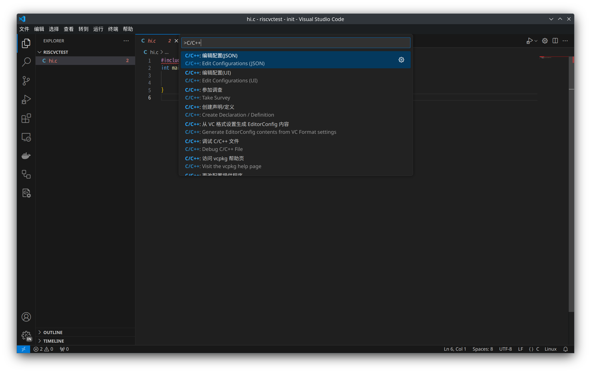

## 基于 VSCode 的 C 语言交叉编译与调试

> [!WARNING]  
> VSCode C/C++ 插件的 IntelliSense 目前并不支持 RISC-V 作为 target，需要手动编写配置文件。

以下内容仅供参考。

1. 安装 C/C++ 插件：[Visual Studio Marketplace](https://marketplace.visualstudio.com/items?itemName=ms-vscode.cpptools) 或 `ext install ms-vscode.cpptools`


2. 打开 C/C++ 插件配置界面，指定编译器位置（此处为 Arch Linux 下的 `riscv64-linux-gnu-gcc` 包，gcc 位置为 `/usr/bin/riscv64-linux-gnu-gcc`）




3. 选择 IntelliSense 模式。

> 目前 VSCode 的 IntelliSense 只支持 x86 / x64 / ARM / ARM64。

选择 `gcc-x86`。其他选项可能会有问题。


4. 编辑 `.vscode/c_cpp_properties` 配置文件。

```json
{
    "configurations": [
        {
            "name": "Linux",
            "includePath": [
                "${workspaceFolder}/**"
            ],
            "defines": [],
            "cStandard": "c17",
            "cppStandard": "gnu++17",
            "intelliSenseMode": "gcc-x86",
            "compilerPath": "/usr/bin/riscv64-linux-gnu-gcc",
            "compilerArgs": [
                "-static"
            ]
        }
    ],
    "version": 4
}
```

5. 点击右上角的三角形图标（运行 C/C++ 文件）。

6. 正确输出了静态编译的目标二进制。

